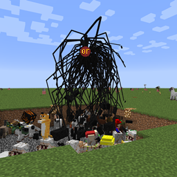

# 变身：高清修复兼容

[English](./README.md) | [简体中文]

  

使 [变身](https://www.curseforge.com/minecraft/mc-mods/morph) 兼容 [高清修复](https://optifine.net/home)

支持任意版本的变身及其分支

> 本模组为**客户端模组**，服务端无需安装

## 赞助

## 开源协议

本项目采用 [LGPL-3.0](./LICENSE) 协议开源
